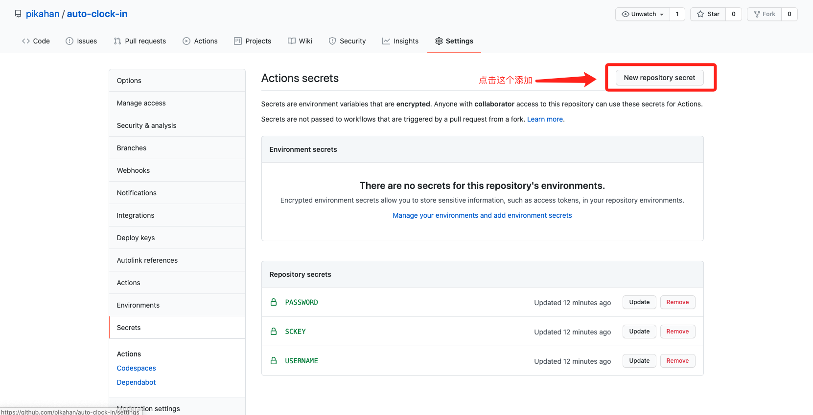
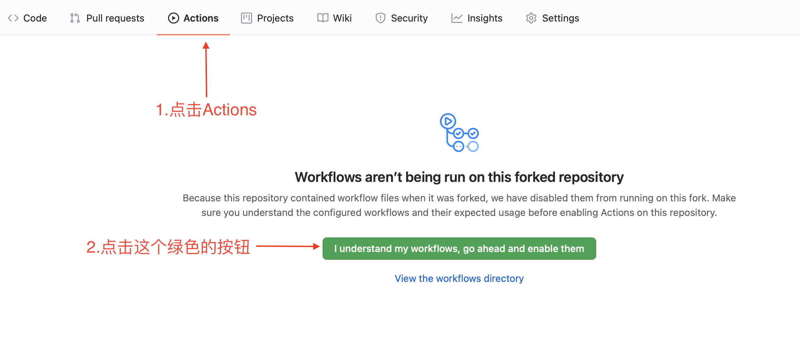
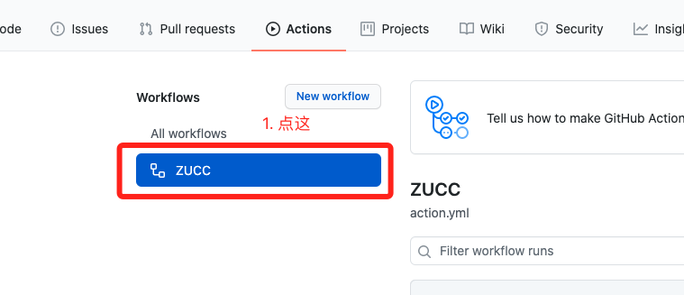
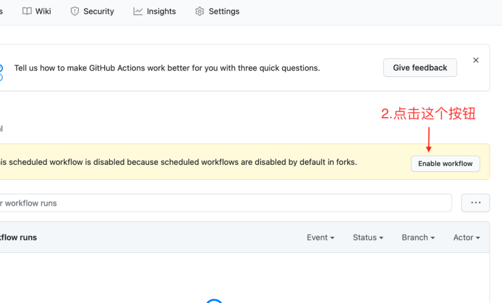

## 使用

1. `Fork`本仓库(顺便来个星星吧)
2. 在`Settings -> Secrets`中添加相应的账户信息, 见下表

|Secrets Name|Value|Remark
|---|---|---|
|USERNAME|填写你的学号|
|PASSWORD|填写你的密码(身份证后6位)|
|SCKEY|Server酱提供的微信通知, 可不填|[Server酱](http://sc.ftqq.com/3.version)获取 SCKEY

3. 开启Actions

## TODO
- [ ] 自定义选项配置
- [ ] 选项变更后提醒